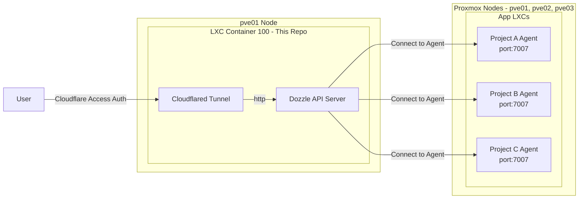

# NUTFes Dozzle Agent Server

複数プロジェクトのコンテナログを、[Dozzle Agent](http://dozzle.dev/guide/agent) 機能を用いて集約し、Cloudflare Accessでセキュアに一元管理するためのサーバー基盤リポジトリです。

## このプロジェクトが必要な背景

NUTFesのシステムインフラは、複数のProxmox（PVE）ノード上のLXCに分散して各プロジェクトが稼働しています。この構成において、以下の課題がありました。

1. **アクセス権限の制約:** PVE環境へアクセスし操作できるのはインフラチームと一部の権限を持つメンバーのみに限られており、各プロジェクトの開発者が直接コンテナログを確認することが困難でした。
2. **ログ確認の煩雑さ:** 複数のサーバー（ノードやLXC）にログが分散しているため、障害調査やデバッグ時に各環境へ個別にアクセスしてログを探す作業が非常に煩雑でした。
3. **エラーの早期発見:** サービスでエラーが発生した際、即座に気づいて対応できる監視・通知の仕組み（Slack通知など）が必要でした。

これらの課題を解決するため、Dozzleを用いて分散したログを一元管理し、開発者がPVEに直接アクセスせずともセキュアにログを閲覧・検索できる基盤を構築しました。さらに、Dozzleのアラート機能（v10以降）を活用し、特定のエラーログを検知してSlackへ即座に通知（Incoming Webhooks連携）する監視体制を実現しています。

---

## 構成概要

各種プロダクトのデプロイ先は3台のProxmoxノード上のLXCを想定しています。本サーバー（ダッシュボード）は `pve01` ノードに専用のLXCを立てて稼働させています。

- **Dozzle Server（本リポジトリ）稼働先:** `pve01` ノード内の **LXC Container 100 (dozzle)**
- **連携対象のProxmoxノード一覧:**
  - `pve01`: [https://proxmox-pve01.nutmeg.cloud](https://proxmox-pve01.nutmeg.cloud)
  - `pve02`: [https://proxmox-pve02.nutmeg.cloud](https://proxmox-pve02.nutmeg.cloud)
  - `pve03`: [https://proxmox-pve03.nutmeg.cloud](https://proxmox-pve03.nutmeg.cloud)

各プロジェクトのLXC内にDozzle Agentを配置し、`pve01` (CT 100) のDozzle Serverから各Agentのポート(`7007`)へ接続してログを収集するアーキテクチャとなります。

---

## 導入方法（各プロジェクト開発者向け）

自分の担当しているプロジェクトのログをこの中央ダッシュボードへ出力するには、プロジェクトの `compose.yml` に Agent コンテナの定義を追記するだけです。

### 1. プロジェクトへのAgentの追加手順（コピペで完了）

既存の `compose.yml` に以下を **そのままコピペして追加** してください。
`[YOUR_PROJECT_NAME]` の部分だけ、ご自身のプロジェクトやコンテナ名に合わせて変更してください。

```yaml
services:
  # --- ここから下を追記 ---

  dozzle-agent:
    image: amir20/dozzle:latest
    command: agent
    container_name: dozzle-agent-[YOUR_PROJECT_NAME]
    volumes:
      - /var/run/docker.sock:/var/run/docker.sock:ro
    ports:
      - "7007:7007"
    environment:
      - DOZZLE_HOSTNAME=[YOUR_PROJECT_NAME]
    restart: always
    healthcheck:
      test: ["CMD", "/dozzle", "healthcheck"]
      interval: 3s
      timeout: 3s
      retries: 5

# --- 追記ここまで ---
```

---

## 運用・構築手順（インフラ管理者向け）

### リポジトリ構成イメージ



### 1. サーバー（LXC 100）への配置とセットアップ

Proxmox `pve01` 上のコンテナID `100` (dozzle) へアクセスし、本リポジトリをcloneします。

```bash
git clone https://github.com/NUTFes/dozzle-agent-server.git
cd dozzle-agent-server
cp .env.example .env
```

### 2. 環境変数の設定

`.env` ファイルを開き、環境変数を設定します。

- **`DOZZLE_REMOTE_AGENT`**: ログを収集したい各プロジェクト(Agent)のエンドポイントをカンマ区切りで列挙します。各LXCのIPアドレスを指定します。
  - _フォーマット:_ `[ホストIPアドレス]:7007`
  - _例:_ `192.168.10.2:7007,192.168.10.3:7007,192.168.10.4:7007`
- **`TUNNEL_TOKEN`**: Cloudflare Zero Trust ダッシュボードで払い出された Cloudflared Tunnel のトークン

### 3. モニタリングの起動

以下のコマンドでDozzle ServerとCloudflaredトンネルのコンテナを起動します。

```bash
docker compose up -d
```

設定したCloudflare TunnelのPublic Hostnameにアクセスすると、認証通過後にすべてのプロジェクト(Agent)のログが一元化されたダッシュボードで閲覧可能になります。

新しくAgentが追加された場合は、`.env`の `DOZZLE_REMOTE_AGENT` にIPを追記し、このサーバーの `docker compose up -d` を再実行して反映させます。

---

## Slack通知（アラート）の設定手順

Dozzleの機能を利用して、特定のログ（エラーなど）が出力された際にSlackへアラートを送信することができます。
設定には、まずSlack側でWebhook URLを発行し、それをDozzle側に登録します。

### 1. SlackでのWebhook URLの発行 (Slack Appの作成)

1. [Slack API - Your Apps](https://api.slack.com/apps) にアクセスします。
2. または画面右上の「**Create New App**」ボタンをクリックします。
3. 「**From scratch**」を選択します。
4. **App Name**（例: `Dozzle`）を入力し、追加先のワークスペースを選択して「**Create App**」をクリックします。
5. Appの設定画面が開いたら、左側のメニューから「**Incoming Webhooks**」を選択します。
6. 「**Activate Incoming Webhooks**」のトグルを「**On**」にします。
7. 画面下部にある「**Add New Webhook to Workspace**」ボタンをクリックします。
8. 通知を送信したいチャンネルを選択し、許可します。
9. チャンネル用の **Webhook URL**（`https://hooks.slack.com/services/...` から始まるURL）が発行されるので、コピーして控えておきます。

### 2. Dozzle側の通知設定（Notifications）を開く

Dozzleダッシュボードの画面右上のベルマーク（Notifications）をクリックして設定画面を開きます。

### 3. 送信先の追加（Destinations）

「**Add destination**」をクリックし、SlackへのWebhook先を登録します。

- **Type**: `HTTP Webhook` を選択
- **Name**: 任意のわかりやすい名前（例: `Production Slack`）を入力
- **Webhook URL**: 先ほどSlackで発行した **Incoming Webhook のURL** を入力
- **Payload Format**: `Slack` を選択
- 「**Add Destination**」を押して保存します。

### 4. アラート条件の作成（Alerts）

次に、どのようなログが発生した際に通知を飛ばすか（アラート）を作成します。「**+ Add**」をクリックして設定を行います。

- **Alert Name**: アラートの名称（例: `Test API Errors`）を入力
- **Alert Type**: `Log Alert` を選択
- **Container Filter**: 監視対象のコンテナの絞り込み条件（例: `name contains "api"`）
- **Log Filter**: 通知させたいログの条件（例: `level == "error" && message contains "timeout"`）
- **Destination**: 手順3で追加した送信先（Destination）を選択
- 「**Create Alert**」を押して保存します。
