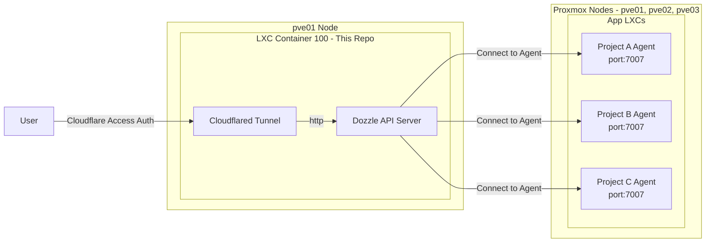

# NUTFes Dozzle Agent Server

複数プロジェクトのコンテナログを、[Dozzle Agent](http://dozzle.dev/guide/agent) 機能を用いて集約し、Cloudflare Accessでセキュアに一元管理するためのサーバー基盤リポジトリです。

## このプロジェクトが必要な背景

NUTFesのシステムインフラは、複数のProxmox（PVE）ノード上のLXCに分散して各プロジェクトが稼働しています。この構成において、以下の課題がありました。

1. **アクセス権限の制約:** PVE環境へアクセスし操作できるのはインフラチームと一部の権限を持つメンバーのみに限られており、各プロジェクトの開発者が直接コンテナログを確認することが困難でした。
2. **ログ確認の煩雑さ:** 複数のサーバー（ノードやLXC）にログが分散しているため、障害調査やデバッグ時に各環境へ個別にアクセスしてログを探す作業が非常に煩雑でした。
3. **エラーの早期発見:** サービスでエラーが発生した際、即座に気づいて対応できる監視・通知の仕組み（Slack通知など）が必要でした。

これらの課題を解決するため、Dozzleを用いて分散したログを一元管理し、開発者がPVEに直接アクセスせずともセキュアにログを閲覧・検索できる基盤を構築しました。さらに、Dozzleのアラート機能（v10以降）を活用し、特定のエラーログを検知してSlackへ即座に通知（Incoming Webhooks連携）する監視体制を実現しています。

---

## 構成概要

各種プロダクトのデプロイ先は3台のProxmoxノード上のLXCを想定しています。本サーバー（ダッシュボード）は `pve01` ノードに専用のLXCを立てて稼働させています。

- **Dozzle Server（本リポジトリ）稼働先:** `pve01` ノード内の **LXC Container 100 (dozzle)**
- **連携対象のProxmoxノード一覧:**
  - `pve01`: [https://proxmox-pve01.nutmeg.cloud](https://proxmox-pve01.nutmeg.cloud)
  - `pve02`: [https://proxmox-pve02.nutmeg.cloud](https://proxmox-pve02.nutmeg.cloud)
  - `pve03`: [https://proxmox-pve03.nutmeg.cloud](https://proxmox-pve03.nutmeg.cloud)

各プロジェクトのLXC内にDozzle Agentを配置し、`pve01` (CT 100) のDozzle Serverから各Agentのポート(`7007`)へ接続してログを収集するアーキテクチャとなります。

---

## 導入方法（各プロジェクト開発者向け）

自分の担当しているプロジェクトのログをこの中央ダッシュボードへ出力するには、プロジェクトの `compose.yml` に Agent コンテナの定義を追記するだけです。

### 1. プロジェクトへのAgentの追加手順（コピペで完了）

既存の `compose.yml` に以下を **そのままコピペして追加** してください。
`[YOUR_PROJECT_NAME]` の部分だけ、ご自身のプロジェクトやコンテナ名に合わせて変更してください。

```yaml
services:
  # --- ここから下を追記 ---

  dozzle-agent:
    image: amir20/dozzle:latest
    command: agent
    container_name: dozzle-agent-[YOUR_PROJECT_NAME]
    volumes:
      - /var/run/docker.sock:/var/run/docker.sock:ro
    ports:
      - "7007:7007"
    environment:
      - DOZZLE_HOSTNAME=[YOUR_PROJECT_NAME]
    restart: always
    healthcheck:
      test: ["CMD", "/dozzle", "healthcheck"]
      interval: 3s
      timeout: 3s
      retries: 5

# --- 追記ここまで ---
```

---

## Slack連携とアラート設定について

Dozzle（v10以降）は、強力なアラート機能を内蔵しています。特定のコンテナで特定のエラーログが出力された際に、Slackなどの外部サービスへ通知を送ることができます。

### 1. Slack通知先（Destination）の設定手順

DozzleからSlackへ通知を送るためには、Slackの「Incoming Webhooks」を利用します。

1. **Slack側での準備:** 通知を送りたいSlackチャンネルでIncoming Webhooksの設定を行い、Webhook URL（例: `https://hooks.slack.com/services/XXX/YYY/ZZZ`）を取得します。
2. **Dozzle UIでの設定:**
   - DozzleのWeb画面右上のメニューから **「Settings」**（歯車アイコン）を開きます。
   - 左側メニューの **「Alerts & Webhooks」** を選択します。
   - **「Destinations」** タブを開き、**「New Destination」** をクリックします。
   - Typeを **「Webhook」** に設定し、Nameに任意の名前（例: `NUTFes Slack Error Alert`）を入力します。
   - URLに取得した **Slack Incoming Webhook URL** を貼り付けます。
   - Payload Templateで **「Slack」** を選択すると、Slackに最適化されたフォーマットが自動適用されます。
   - 「Test」ボタンで通知が飛ぶか確認し、「Save」で保存します。

※ Dozzleのアラート設定は `/data` ボリューム内に永続化されるため、サーバー再起動後も保持されます。

### 2. 新規アラート対象（ルール）を追加する方法

プロジェクトごとに「このコンテナでエラーが出たら通知する」というアラートルールを作成します。

1. **Dozzle UIでの設定:**
   - **「Settings」** > **「Alerts & Webhooks」** の画面を開きます。
   - **「Alerts」** タブを開き、**「New Alert」** をクリックします。
   - Nameに分かりやすい名前（例: `[プロジェクト名] API Error`）を入力します。
   - Destinationに、先ほど作成したSlackの通知先を選択します。
2. **フィルタの記述:**
   アラートを発火させる条件を2つのフィルタ（式）で指定します。

   - **Container Filter（監視対象コンテナの絞り込み）**
     どのコンテナを監視するかを指定します。
     *例:* `name contains "api"` （名前に"api"が含まれるコンテナ）
     *例:* `labels["env"] == "production"` （productionラベルが付いたコンテナ）
     *例:* `name == "my-project-backend"` （特定のコンテナ名に完全一致）

   - **Log Filter（通知するログの条件）**
     どのようなログメッセージが出た時に通知するかを指定します。
     *例:* `level == "error"` （ログレベルがerrorの場合）
     *例:* `message contains "panic" || message contains "Exception"` （特定の文字列が含まれる場合）
     *例:* `message.status >= 500` （JSONログでステータスコードが500以上の場合）

3. 画面下部にプレビューが表示され、設定したフィルタに現在マッチしているコンテナやログが確認できます。「Save」で保存すると監視が開始されます。

---

## 運用・構築手順（インフラ管理者向け）

### リポジトリ構成イメージ



### 1. サーバー（LXC 100）への配置とセットアップ

Proxmox `pve01` 上のコンテナID `100` (dozzle) へアクセスし、本リポジトリをcloneします。

```bash
git clone https://github.com/NUTFes/dozzle-agent-server.git
cd dozzle-agent-server
cp .env.example .env
```

### 2. 環境変数の設定

`.env` ファイルを開き、環境変数を設定します。

- **`DOZZLE_REMOTE_AGENT`**: ログを収集したい各プロジェクト(Agent)のエンドポイントをカンマ区切りで列挙します。各LXCのIPアドレスを指定します。
  - _フォーマット:_ `[ホストIPアドレス]:7007`
  - _例:_ `192.168.10.2:7007,192.168.10.3:7007,192.168.10.4:7007`
- **`TUNNEL_TOKEN`**: Cloudflare Zero Trust ダッシュボードで払い出された Cloudflared Tunnel のトークン

### 3. モニタリングの起動

以下のコマンドでDozzle ServerとCloudflaredトンネルのコンテナを起動します。

```bash
docker compose up -d
```

設定したCloudflare TunnelのPublic Hostnameにアクセスすると、認証通過後にすべてのプロジェクト(Agent)のログが一元化されたダッシュボードで閲覧可能になります。

新しくAgentが追加された場合は、`.env`の `DOZZLE_REMOTE_AGENT` にIPを追記し、このサーバーの `docker compose up -d` を再実行して反映させます。
